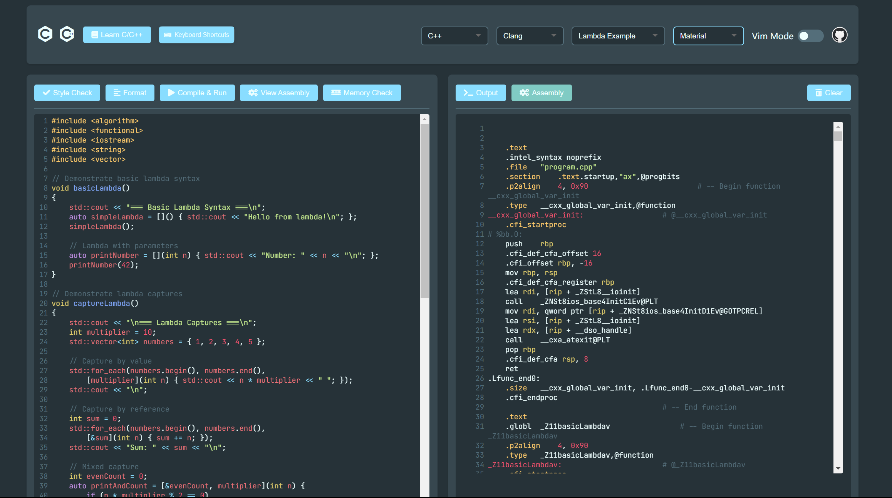

# WEB c/c++ code editor and compiler

This project is a web-based code editor and compiler for C/C++ programs. It allows users to write, compile, and run code directly in the browser. The application is built using JavaServer Pages (JSP) and runs on Apache Tomcat.

# sample



# Try it(no guarantee always available due to myself's server)

http://116.62.132.169:9527/webCpp/

---

# Features ✨

- **Syntax Highlighting**: Enhance code readability with different colors for keywords, strings, and comments.
- **Vim Keybindings**: Enable Vim-style navigation and editing for users familiar with Vim.
- **Show Assembly Code**: Provide an option to view the generated assembly code for the written code.
- **Save and Load Code**: Allow users to save their code snippets to local storage and load them when needed.
- **Multiple Themes**: Offer a variety of themes for personalized aesthetics.

# Shortcut Keys 🔑

- **Compile and Run**: `Ctrl/Cmd + Enter` to compile and run code.
- **Show Assembly Code**: `Ctrl/Cmd + Shift + A` to display assembly code.
- **Clear Output**: `Ctrl/Cmd + L` to clear output window.
- **Save to Local Storage**: `Ctrl/Cmd + S` to save current code.
- **Load from Local Storage**: `Ctrl/Cmd + O` to load previously saved code.
- **Format Code**: `Ctrl/Cmd + Alt + F` to format code for better readability.
- **Style Check** : `Ctrl/Cmd + Alt + C` to check code style.
- **Memory Check** : `Ctrl/Cmd + Alt + L` to check memory leak.

# Themes 🎨

- **Neo**: A modern theme with a futuristic design and vibrant colors.
- **Nord**: A polar night-inspired color palette that’s easy on the eyes.
- **Dracula**: A dark theme with vibrant colors for a striking contrast.
- **Monokai**: A classic dark theme with bright accents, popular among developers.
- **Material**: A material design-inspired theme that offers a modern aesthetic.
- **Ayu-dark**: A soothing dark theme with soft colors.
- **Gruvbox-dark**: A retro groove style with a comfortable color palette.
- **seti**: A vibrant theme with a dark background and colorful accents.

---

## Architecture

The following diagram illustrates the architecture of the project:

```
[Browser]                                              [Server]
   |                                                      |
   |  HTTP/HTTPS Request                                  |
   | ------------------------------------------------>    |
   |  POST /compile.jsp                                   |
   |  Content-Type: application/x-www-form-urlencoded     |
   |  code=...&lang=...&compiler=...&optimization=...     |
   |                                                      |
   |                                                      |
   |  HTTP/HTTPS Response                                 |
   | <------------------------------------------------    |
   |  Content-Type: text/plain                            |
   |  Compilation output / Error messages                 |
   |                                                      |
+------------+     +-----------------+     +---------------+
|            |     |                 |     |               |
| CodeMirror |<--->| JavaScript API  |<--->| JSP Backend   |
|   Editor   |     | Processing Layer|     | Services      |
|            |     |                 |     |               |
+------------+     +-----------------+     +---------------+
     |                    |                        |
     |                    |                        |
     v                    v                        v
+------------+     +-----------------+     +-----------------+
| Code Input |     | Request Router  |     | Session Manager |
| Syntax     |     | Parameter       |     | Temp File       |
| Highlight  |     | Processing      |     | Creation        |
+------------+     +-----------------+     +-----------------+
                           |                        |
                           v                        v
                   +-----------------+     +-----------------+
                   | Compile Request |     | GCC/Clang       |
                   | Format Request  |     | clang-format    |
                   | Memory Check    |     | Valgrind        |
                   | Style Check     |     | cppcheck        |
                   +-----------------+     +-----------------+
                           |                        |
                           v                        v
                   +-----------------+     +-----------------+
                   | Result Parser   |     | Output Handler  |
                   | Error Formatter |     | Temp File       |
                   | HTML Renderer   |     | Cleanup         |
                   +-----------------+     +-----------------+
                           |                        |
                           v                        v
                   +------------------------------------- ---+
                   |           Result Display                |
                   | +----------------+  +----------------+  |
                   | | Program Output |  | Assembly Code  |  |
                   | +----------------+  +----------------+  |
                   | | Error Messages |  | Memory Check   |  |
                   | +----------------+  +----------------+  |
                   +------------------------------------- ---+

Data Flow:
code/params -----> Frontend API -----> JSP Processing -----> Compile/Analysis Tools
                                                                |
Result Display <---- Frontend Render <---- Result Parse <------ +
```

# setup guide

## Prerequisites

First, install the required packages:

```bash
sudo apt update
sudo apt install openjdk-11-jdk tomcat9 gcc g++ clang clang-format valgrind cppcheck
```

## Project Setup

Create the necessary directories in Tomcat's webapps folder:

```bash
# Clone the repository
git clone https://github.com/Pp3ng/webCpp.git

# Move the project to Tomcat's webapps folder
mv webCpp /var/lib/tomcat9/webapps/webCpp

# Change directory
cd /var/lib/tomcat9/webapps/webCpp

# Create required subdirectories
sudo mkdir tmp
```

### 2. Set File Permissions

Configure the correct permissions for the project:

```bash
# Change ownership
sudo chown -R tomcat:tomcat /var/lib/tomcat9/webapps/webCpp
# Change permissions
sudo chmod -R 755 /var/lib/tomcat9/webapps/webCpp
# Create tmp directory
sudo mkdir -p /var/lib/tomcat9/webapps/webCpp/tmp
# Change ownership and permissions
sudo chown -R tomcat:tomcat /var/lib/tomcat9/webapps/webCpp/tmp
# Change permissions
sudo chmod -R 777 /var/lib/tomcat9/webapps/webCpp/tmp
```

### 3. Configure Tomcat Security

Add necessary permissions to Tomcat's security policy:

```bash
# Edit the policy file
sudo vim /var/lib/tomcat9/conf/catalina.properties
```

Add these lines at the end of the file:

```
grant codeBase "file:${catalina.home}/webapps/code-editor/-" {
    permission java.io.FilePermission "/var/lib/tomcat9/webapps/code-editor/tmp/*", "read,write,delete,execute";
    permission java.io.FilePermission "/usr/bin/gcc", "execute";
    permission java.io.FilePermission "/usr/bin/g++", "execute";
    permission java.io.FilePermission "/usr/bin/clang", "execute";
    permission java.io.FilePermission "/usr/bin/clang++", "execute";
    permission java.io.FilePermission "/usr/bin/clang-format", "execute";
    permission java.io.FilePermission "/usr/bin/valgrind", "execute";
    permission java.lang.RuntimePermission "createClassLoader";
    permission java.lang.RuntimePermission "getClassLoader";
    permission java.lang.RuntimePermission "setContextClassLoader";
    permission java.lang.RuntimePermission "exitVM.0";
};
```

### 4. Start the Service

Restart Tomcat to apply changes:

```bash
sudo systemctl restart tomcat9
```

then you can visit http://localhost:8080/webCpp/ and enjoy it.

## Verification

### 1. Check Service Status

```bash
# Check Tomcat status
sudo systemctl status tomcat9

# View logs
sudo tail -f /var/lib/tomcat9/logs/catalina.out
```
